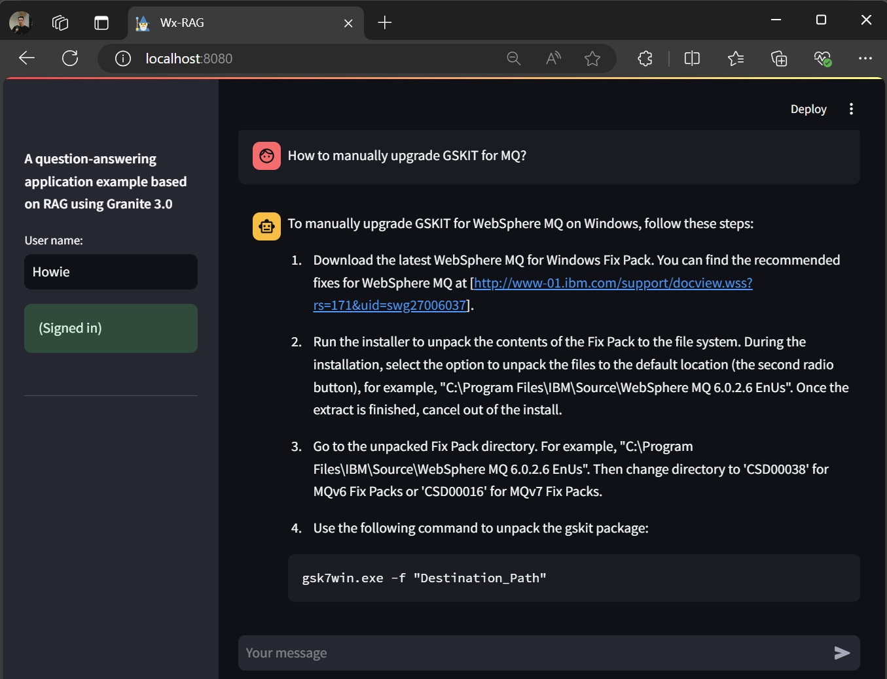

# Watsonx LLMs-powered examples 

## Scope

The examples are intended for learning or demonstration purposes. In some cases, best practices for development may be simplified or omitted. In real-world applications, additional effort and considerations are often required to build robust and effective solutions.

## Overview

This repository includes examples showcasing the use of IBM foundation models including **IBM Granite 3.0** in combination with concepts such as Chain-of-Thought (CoT), Reasoning & Acting (ReAct), Retrieval-Augmented Generation (RAG), AI Agents, and open-source tools like LangChain and Weaviate.

The examples currently included are:

1. **[wx-q-learning-robotic-agent](wx-q-learning-robotic-agent/)**\
	This is a robotic agent simulation where a robot navigates a 2D grid, aiming to reach a target in as few steps as possible while avoiding walls and obstacles. The task is demonstrated using Q-Learning, a reinforcement learning algorithm. Additionally, as an experiment (not really practical), the LLM granite-3-8b-instruct assists the agent in identifying "getting stuck" scenarios, where it repeatedly visits the same states or actions without progress. These situations, caused by poor Q-values or local cycles, are addressed with the LLM's assistance to help the agent break free. [more...](wx-q-learning-robotic-agent/README.md)
	
	

2. **[wx-tech-support-agent](wx-tech-support-agent/)**\
	This example demonstrates an AI Agent which is a conversational agent, designed to automate a technical support use case by guiding users through a troubleshooting process, and if needed taking appropriate actions. It leverages techniques such as Chain-of-Thought (CoT) prompting and Reasoning & Acting (ReAct) using LangChain, along with multiple LLMs, including Granite 3.0 provided via watsonx.  Additionally, it incorporates features like Chat Memory and Tool Calling to enhance functionality. [more...](wx-tech-support-agent/README.md)

	

3. **[wx-weaviate-embedding-api](wx-weaviate-embedding-api/)**\
	Weaviate is an open-source vector database enabling semantic search through vector embeddings and searches. While it supports many AI platforms, Watsonx is not directly integrated. To use an embedding model like ibm/slate-30m-english-rtrvr, this code provides a workaround by implementing an API that allows Weaviate to consume the model on Watsonx. A shell script is also included to set up a local Weaviate container for demonstration. Both the API and container are required to try the wx-rag-with-granite3 example. [more...](wx-weaviate-embedding-api/README.md)	

4. **[wx-rag-with-granite3](wx-rag-with-granite3/)**\
	The example which is an AI assistant, illustrates how RAG can assist with question-answering tasks via a use case of utilizing a public dataset, **TechQA** (https://research.ibm.com/publications/the-techqa-dataset) to provide answers or information related to IBM products in response to user questions/queries - TechQA is an open domain-adaptation question-answering dataset tailored for the technical support domain. [more...](wx-rag-with-granite3/README.md)

	
	
## A brief introduction to key concepts and related technologies

**watsonx** offers services to use foundation models including LLMs. One of notable models is **IBM Granite 3.0** released in Oct., 2024, which is the third generation in the Granite series of LLMs and complementary tools. Designed to strike a balance between power and practicality, Granite 3.0 offers state-of-the-art performance relative to its model size while prioritizing safety, speed, and cost-efficiency. 

**AI agents**. In general, AI agents are autonomous systems designed to perform specific tasks with minimal or no human intervention. For LLM-powered AI agents, such as those used to automate customer support or troubleshoot technical issues, various techniques and frameworks can be employed. These include LangChain's Reasoning &  Acting (ReAct) framework, tool calls, chat memory, chain-of-thought (CoT) prompting, learning capabilities, and more.

**Reinforcement Learning (RL)**. A type of machine learning where an agent learns to make decisions by interacting with an environment. The agent takes actions, receives feedback in the form of rewards or penalties, and uses this feedback to improve its strategy over time. The goal is to maximize the cumulative reward by learning the best actions to take in different situations. RL is based on the trial-and-error approach and is commonly used in robotics, gaming, and optimization tasks.

**Chain-of-thought prompting** is a strategy that enhances the reasoning capabilities of LLMs by breaking down complex problems into smaller parts and solving them step by step.

**Tool Calling** refer to the ability of an LLM to interact with external tools, systems, or APIs to perform tasks that go beyond the model's internal capabilities. This concept allows LLMs to extend their functionality by leveraging external resources, enabling them to perform specialized tasks, retrieve information, or manipulate data in real-time

**Reasoning and Acting (ReAct)** is a combination of reasoning and acting with LLMs., one of the approaches that allows an AI Agent to take actions based on the results of the model’s reasoning. Furthermore, each subsequent reasoning step can be influenced by the outcome of the previous action, creating a feedback loop where reasoning and acting inform one another.

**Chat memory** refers to the mechanism by which LLM-based agents can maintain and utilize the context of an ongoing conversation to provide coherent, contextually relevant, and dynamic responses. It ensures that an agent can "remember" what has been discussed earlier, enabling it to follow conversational flows, avoid repetition, and produce intelligent, context-aware outputs

**Retrieval-Augmented Generation (RAG)** is a technique used to integrate information or facts from external sources (e.g., knowledge bases, websites, and more) into LLM-powered applications. This allows the models to use the retrieved information as input to perform their tasks more effectively. One of the most common applications of RAG is in question-answering use cases.

**Semantic search** is a searching approach based on vectors involves representing data items as **vector embeddings** (embeddings for short) - mathematical vectors that capture the meanings and relationships of the data points. In the case of text-based information retrieval, instead of relying on traditional keyword-matching techniques, semantic search identifies vectors with the highest similarity to the input embedding (the vector representation of the input text). This approach allows for more accurate and context-aware results by comparing the semantic similarity between texts (i.e., data points).

**Embedding models** are specialized machine learning models designed to transform data (such as text, images, or other types of content) into high-dimensional vector representations a.k.a  embeddings which are numerical representations  capturing the semantic meaning or inherent properties of the input data in a way that similar inputs are mapped to nearby points in the vector space.

**Vector databases** (e.g Milvus, Weaviate, and more) are designed to store, manage, and query vector embeddings, enabling the semantic search functionality.

**LangChain** is a framework designed to build applications that harness the power of Large Language Models (LLMs) by integrating them with external data, tools, and workflows. It simplifies the process of creating complex, dynamic systems by combining the reasoning and natural language capabilities of LLMs with additional functionalities such as memory, tool calls, and retrieval-augmented generation (RAG). Currently it supports Python and Javascript.

## License

Apache-2.0

You may obtain a copy of the License at 
```
http://www.apache.org/licenses/LICENSE-2.0
```

## Author

Nguyen, Hung (Howie) Sy, 
\
https://github.com/howiesnguyen
