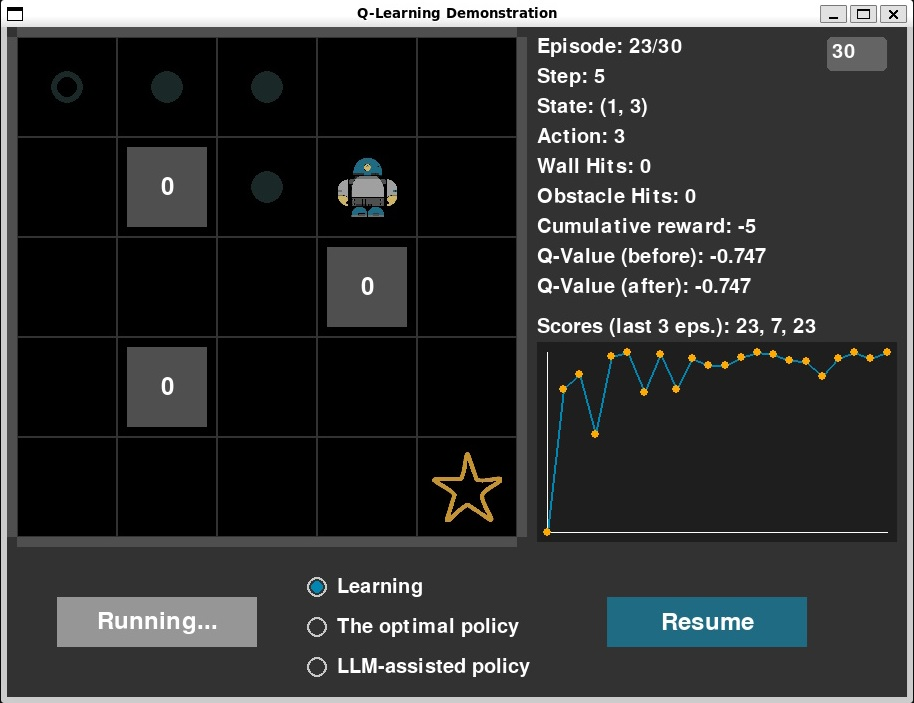
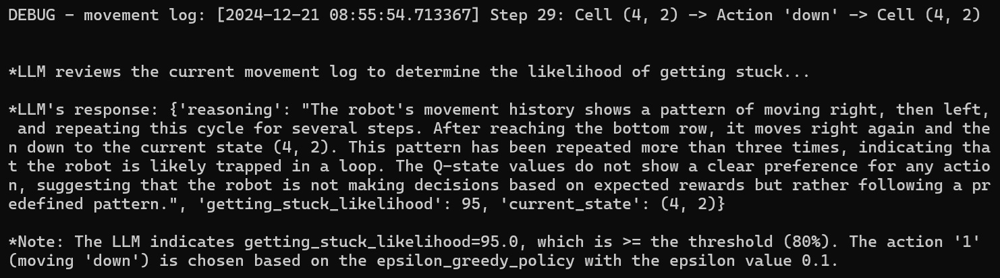

# AI-powered technical support agent example

## Scope

This code is to aim with development or demonstration. In some cases, best practices for development may be simplified or omitted. In real-world applications, additional effort and considerations are often required to build a robust and effective solution.

## Overview

This is a robotic agent simulation where a robot navigates a 2D grid, aiming to reach a target in as few steps as possible while avoiding walls and obstacles. The task is demonstrated using Q-Learning, a reinforcement learning algorithm. 



Additionally, the LLM granite-3-8b-instruct assists the agent in identifying "getting stuck" scenarios, where it repeatedly visits the same states or actions without progress. These situations, caused by poor Q-values or local cycles, are addressed with the LLM's assistance to help the agent break free. This is just an experiment and may not be practical for real-world use cases.



## How to run

### Prerequisites

- This example has been tested in a Linux environment. However, if you are using Windows or MacOS, it should work with minor adjustments to settings or command lines as needed.
- Preferred Python version: 3.12. However, it should also work with Python 3.10 and later versions.
- Assumptions: The current working directory is wx-tech-support-agent. A .env file should exist in this directory, containing the following environment variables as an example:
  
```
WATSONX_URL=https://us-south.ml.cloud.ibm.com
IBM_CLOUD_API_KEY=<your API key>
WATSONX_PROJECT_ID=<your watsonx project id>
```
### Set up and run the code

```
# Change the working directory to wx-q-learning-robotic-agent

# Create and activate the virtual environment
$ python -m venv .venv
$ source .venv/bin/activate

# Install required packages 
$ pip install -r requirements. txt

# Run the program
$ python grid_world_app.py
```

## License

Apache-2.0

You may obtain a copy of the License at 
```
http://www.apache.org/licenses/LICENSE-2.0
```

## Author

Nguyen, Hung (Howie) Sy, 
\
https://github.com/howiesnguyen

