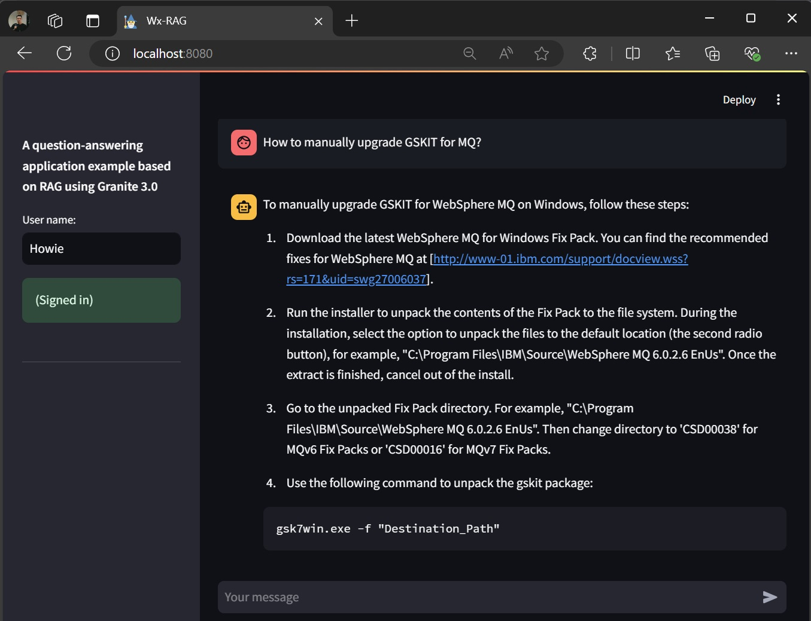

# A Retrieval-Augmented Generation (RAG) example using foundation models including Granite 3.0 powered by watsonx, a vector database with Weaviate, and LangChain

## Scope

This example illustrates how RAG can assist with question-answering tasks. It is intended for learning or demonstration purposes. In some cases, best practices for development may be simplified or omitted. In real-world applications, additional effort and considerations are often required to build a robust and effective solution.

## Overview

In addition to leveraging large language models (LLMs) for reasoning and natural language processing (NLP) to answer user questions, this example incorporates key concepts such as RAG and semantic search using vector embeddings and vector datastores. 

The IBM **Granite 3.0** model which is hosted on **watsonx**, is also utilized in the example. The code is written using Python and makes use of some LangChain libraries.

For the question-answering task, the example showcases an AI assistant designed to respond to user inquiries about information related to IBM products. It draws on information from the dataset TechQA.

### RAG (Retrieval-Augmented Generation)

RAG is a technique used to integrate information or facts from external sources (e.g., knowledge bases, websites, and more) into LLM-powered applications. This allows the models to use the retrieved information as input to perform their tasks more effectively. One of the most common applications of RAG is in question-answering use cases.

This approach offers several benefits, including the ability to provide accurate, up-to-date information quickly and cost-effectively. It eliminates the need for fine-tuning or retraining models, which is often impractical or infeasible in many cases. Additionally, RAG enhances data security by allowing sensitive information to remain in controlled environments while still enabling effective retrieval and generation.

### IBM Granite 3.0

Granite 3.0 is the third generation in the Granite series of LLMs and complementary tools. Designed to strike a balance between power and practicality, Granite 3.0 offers state-of-the-art performance relative to its model size while prioritizing safety, speed, and cost-efficiency.

In this example, the **ibm/granite-3-8b-instruct** version of Granite 3.0 is used as the main model for the question-answering task

Ref.: https://www.ibm.com/new/ibm-granite-3-0-open-state-of-the-art-enterprise-models

### Semantic search, vector embeddings, IBM Slate embedding model and the vector database Weaviate

Semantic search based on vectors involves representing data items as vector embeddings (embeddings for short) - mathematical vectors that capture the meanings and relationships of the data points. In the case of text-based information retrieval, instead of relying on traditional keyword-matching techniques, semantic search identifies vectors with the highest similarity to the input embedding (the vector representation of the input text). This approach allows for more accurate and context-aware results by comparing the semantic similarity between texts (i.e., data points).

One popular method for producing embeddings is to use a pretrained model designed specifically for this purpose. In the example,  the **ibm/slate-30m-english-rtrvr** model, hosted on Watsonx, is utilized to generate embeddings. The embeddings are generated to capture the meaning of the documents from TechQA. The original documents and their embeddings are stored in a database created using the open-source Weaviate platform, which supports NoSQL functionality and semantic search powered by vector embeddings.

There are several approaches to implementing RAG, and this is just one example. In this approach, external information is explicitly incorporated using a prompt template. While this is a simple example and may not perform well or ensure high accuracy in certain cases, it effectively demonstrates the core concept.

## How to run

### Prerequisites

- This example has been tested in a Linux environment. However, if you are using Windows or MacOS, it should work with minor adjustments to settings or command lines as needed.
- Preferred Python version: 3.12. However, it should also work with Python 3.10 and later versions.
- Ensure that [wx-weaviate-embedding-api and the Weaviate container](wx-weaviate-embedding-api/README.md)  are up and running.
- Assumptions: The current working directory is wx-rag-with-granite3. A .env file should exist in this directory, containing the following environment variables as an example:
  
```
# assume wx-weaviate-embedding-api running on localhost via http port 8082 and grpc port 50051
WEAVIATE_HOSTNAME=localhost
WEAVIATE_PORT=8082
WEAVIATE_GRPC_PORT=50051

WATSONX_URL=https://us-south.ml.cloud.ibm.com
IBM_CLOUD_API_KEY=<your API key>
WATSONX_PROJECT_ID=<your watsonx project id>
```

### Set up and run the code

```
# Create and activate the virtual environment
$ python -m venv .venv
$ source .venv/bin/activate

# Install required packages 
$ pip install -r requirements.txt

# The weaviate_importer script will import the tech notes (documents) from the file techqa_technote_faq_samples.json into the coleection named 'TechNote' in the Weaviate database. Therefore beforing running the script, download the TechQA dataset and look for a json file which contains technotes. And then you can either extract a part of its content and save as the file techqa_technote_faq_samples.json, or modify the script to specify the technote json file you want.

$ python weaviate_importer.py

# Run the application, and then it should be able to be accessed via the URL http://localhost:8080/ using a web browser
$ streamlit run rag_sl.py
```



## License

Apache-2.0

You may obtain a copy of the License at 
```
http://www.apache.org/licenses/LICENSE-2.0
```

## Author

Nguyen, Hung (Howie) Sy, 
\
https://github.com/howiesnguyen
