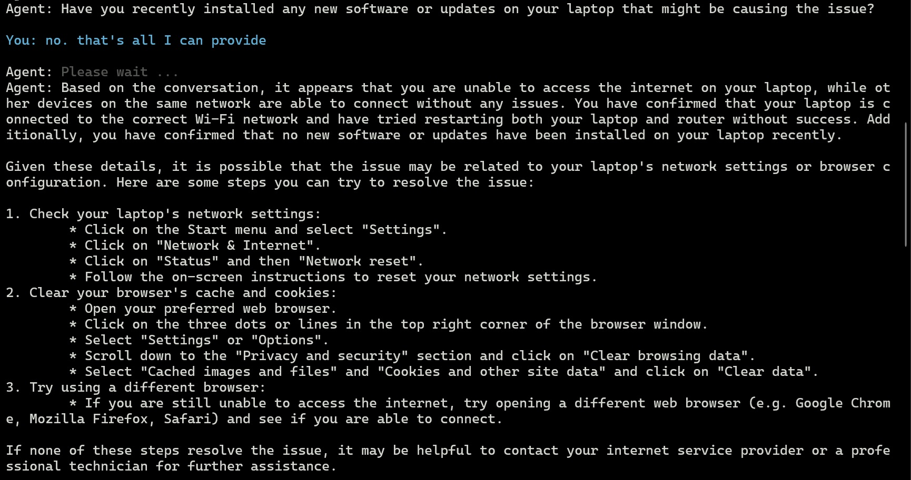
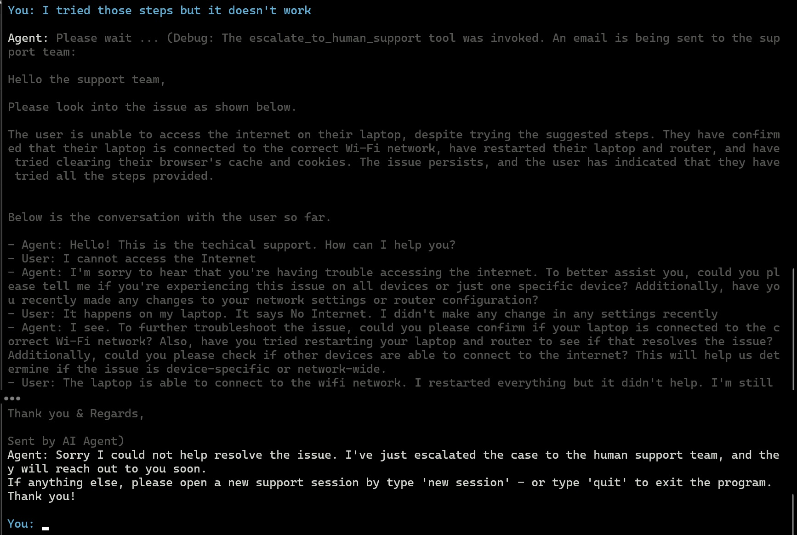

# AI-powered technical support agent example

## Scope

This code is to aim with development or demonstration. In some cases, best practices for development may be simplified or omitted. In real-world applications, additional effort and considerations are often required to build a robust and effective solution.

## Overview

This example demonstrates an AI Agent designed to automate a technical support use case by guiding users through a troubleshooting process. It leverages techniques such as Chain-of-Thought (CoT) prompting and Reasoning & Acting (ReAct) using LangChain, along with multiple LLMs, including Granite 3.0 provided via Watsonx. Additionally, it incorporates features like Chat Memory and Tool Calling to enhance functionality.

**AI agents**. In general, AI agents are autonomous systems designed to perform specific tasks with minimal or no human intervention. For LLM-powered AI agents, such as those used to automate customer support or troubleshoot technical issues, various techniques and frameworks can be employed. These include LangChain's Reasoning &  Acting (ReAct) framework, tool calls, chat memory, chain-of-thought (CoT) prompting, learning capabilities, and more.

**Chain-of-thought prompting** is a strategy that enhances the reasoning capabilities of LLMs by breaking down complex problems into smaller parts and solving them step by step.

**Tool calls** refer to the ability of an LLM to interact with external tools, systems, or APIs to perform tasks that go beyond the model's internal capabilities. This concept allows LLMs to extend their functionality by leveraging external resources, enabling them to perform specialized tasks, retrieve information, or manipulate data in real-time

**Reasoning and Acting (ReAct)** is a combination of reasoning and acting with LLMs., one of the approaches that allows an AI Agent to take actions based on the results of the model’s reasoning. Furthermore, each subsequent reasoning step can be influenced by the outcome of the previous action, creating a feedback loop where reasoning and acting inform one another.

**Chat memory** refers to the mechanism by which LLM-based agents can maintain and utilize the context of an ongoing conversation to provide coherent, contextually relevant, and dynamic responses. It ensures that an agent can "remember" what has been discussed earlier, enabling it to follow conversational flows, avoid repetition, and produce intelligent, context-aware outputs

## How to run

### Prerequisites

- This example has been tested in a Linux environment. However, if you are using Windows or MacOS, it should work with minor adjustments to settings or command lines as needed.
- Preferred Python version: 3.12. However, it should also work with Python 3.10 and later versions.
- Assumptions: The current working directory is wx-tech-support-agent. A .env file should exist in this directory, containing the following environment variables as an example:
  
```
WATSONX_URL=https://us-south.ml.cloud.ibm.com
IBM_CLOUD_API_KEY=<your API key>
WATSONX_PROJECT_ID=<your watsonx project id>
```
### Set up and run the code

```
# Change the working directory to wx-tech-support-agent

# Create and activate the virtual environment
$ python -m venv .venv
$ source .venv/bin/activate

# Install required packages 
$ pip install -r requirements. txt

# Run the program
$ python tech_support_agent.py
```





## License

Apache-2.0

You may obtain a copy of the License at 
```
http://www.apache.org/licenses/LICENSE-2.0
```

## Author

Nguyen, Hung (Howie) Sy, 
\
https://github.com/howiesnguyen

